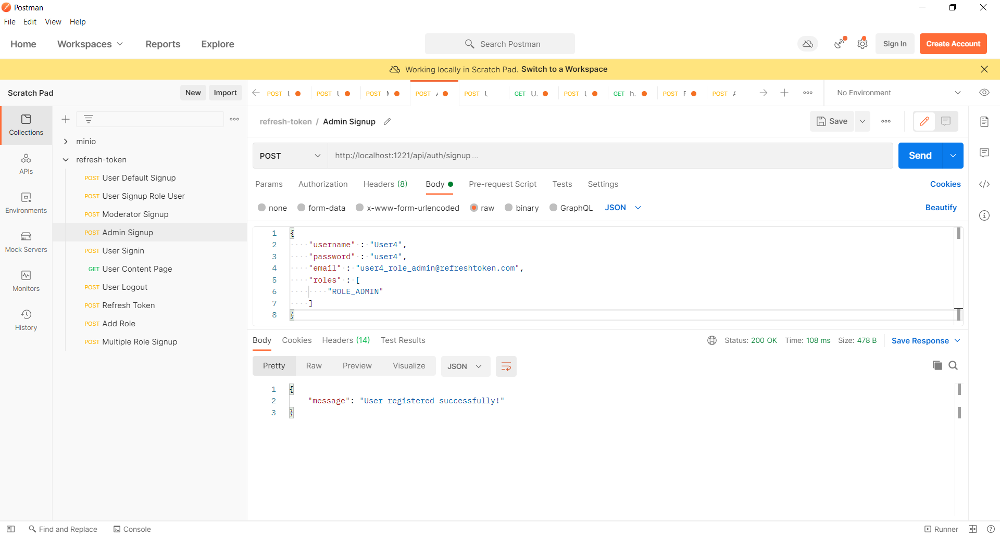

# Spring Boot Refresh Token with JWT


### 📖 Information

<ul style="list-style-type:disc">
  <li>Once the JWT has expired, the user/system will make a call to another url suppose /refreshtoken. Also along with this request the expired JWT should be passed. The Server will then return a new JWT which can be used by the user/system</li>
  <li>Here is the explanation of the project
      <ul>
        <li>Implement the process of registering for user by default of its defined role</li>
        <li>Implement the process of signing in the system for user</li>
        <li>Implement the process of refreshing token when JWT has expired</li>
        <li>Implement the process of opening page with respect to user's defined role</li>
        <li>Implement the process of signing out from the system for user</li>
      </ul>
  </li>
</ul>

### 🔨 Run the App

<b>1 )</b> Download your project from this link `https://github.com/Rapter1990/SpringBootRefreshTokenJWT`

<b>2 )</b> Go to the project's home directory :  `cd SpringBootRefreshTokenJWT`

<b>3 )</b> Create a jar file though this command `mvn clean install`

<b>4 )</b> Run the project though this command `mvn spring-boot:run`

<b>5 )</b> Explore Rest APIs
<table style="width:100%">
  <tr>
    <th>Method</th>
    <th>Url</th>
    <th>Description</th>
    <th>Valid Request Body</th>
    <th>Valid Header</th>
  </tr>
  <tr>
    <td>POST</td>
    <td>/signup</td>
    <td>Sign Up</td>
    <td><a href="README.md#signup">Info</a></td>
    <td></td>
  </tr>
  <tr>
      <td>POST</td>
      <td>/signin</td>
      <td>Sign In</td>
      <td><a href="README.md#signin">Info</a></td>
      <td></td>
  </tr>
  <tr>
      <td>POST</td>
      <td>/logout</td>
      <td>Logout</td>
      <td></td>
      <td><a href="README.md#logout">Info</a></td>
  </tr>
  <tr>
      <td>POST</td>
      <td>/refreshtoken</td>
      <td>Refresh Token</td>
      <td><a href="README.md#refreshtoken">Info</a></td>
      <td></td>
  </tr>
  <tr>
      <td>GET</td>
      <td>/pages/all</td>
      <td>Show Public Content</td>
      <td></td>
      <td><a href="README.md#pagesall">Info</a></td>
  </tr>
  <tr>
       <td>GET</td>
       <td>/pages/user</td>
       <td>Show User Content</td>
       <td></td>
       <td><a href="README.md#pageuser">Info</a></td>
  </tr>
  <tr>
       <td>GET</td>
       <td>/pages/admin</td>
       <td>Show Admin Content</td>
       <td></td>
       <td><a href="README.md#pageadmin">Info</a></td>
  </tr>
  <tr>
       <td>GET</td>
       <td>/pages/moderator</td>
       <td>Show Moderator Content</td>
       <td></td>
       <td><a href="README.md#pagemoderator">Info</a></td>
  </tr>
</table>

### Used Dependencies
* Spring Boot Web
* Spring Security
* Spring Boot Test
* Spring Boot Starter Validation
* JSON Web Token
* Google Code JSON
* Lombok
* Mysql
* Swagger

## Swagger
> **Access : http://localhost:1221/swagger-ui.html**

## Valid Request Body

##### <a id="signup">Sign Up -> http://localhost:1221/api/auth/signup</a>
```
    {
        "username" : "User1",
        "password" : "user1",
        "email" : "user@refreshtoken.com"
    }
```

```
    {
        "username" : "User1",
        "password" : "user1",
        "email" : "user1_role_user@refreshtoken.com",
        "roles" : [
            "ROLE_USER"
        ]
    }
```

```
    {
        "username" : "User1",
        "password" : "user1",
        "email" : "user1_role_user@refreshtoken.com",
        "roles" : [
            "ROLE_USER", "ROLE_MODERATOR"
        ]
    }
```

##### <a id="signin">Sign In-> http://localhost:1221/api/auth/signin</a>
```
   {
       "username" : "User1",
       "password" : "user1"
   }
```

##### <a id="refreshtoken">Refresh Token -> http://localhost:1221/api/auth/refreshtoken</a>
```
   {
       "refreshToken" : "a93444ea-5c0f-4130-8f80-0cce82d53155"
   }
```

## Valid Header

##### <a id="logout">Logout -> http://localhost:1221/api/auth/logout</a>
```
   http://localhost:1221/api/auth/logout

   Authorization : Bearer {accessToken}
```

##### <a id="pagesall">Show Public Content -> http://localhost:1221/api/pages/all</a>
```
   http://localhost:1221/api/pages/all
```

##### <a id="pageuser">Show User Content -> http://localhost:1221/api/pages/user</a>
```
   http://localhost:1221/api/pages/user

   Authorization : Bearer {accessToken} 
```

##### <a id="pageadmin">Show Admin Content -> http://localhost:1221/api/pages/admin</a>
```
   http://localhost:1221/api/pages/admin

   Authorization : Bearer {accessToken} 
```

##### <a id="pagemoderator">Show Moderator Content -> http://localhost:1221/api/pages/moderator</a>
```
   http://localhost:1221/api/pages/moderator

   Authorization : Bearer {accessToken}
```


### Screenshots

<details>
<summary>Click here to show the screenshots of project</summary>
    <p> Figure 1 </p>
    
    <p> Figure 2 </p>
    
    <p> Figure 3 </p>
    
    <p> Figure 4 </p>
    
    <p> Figure 5 </p>
    
    <p> Figure 6 </p>
    
    <p> Figure 7 </p>
    
    <p> Figure 8 </p>
    
    <p> Figure 9 </p>
    
    <p> Figure 10 </p>
    
    <p> Figure 11 </p>
    
    <p> Figure 12 </p>
    
    <p> Figure 13 </p>
    
</details>